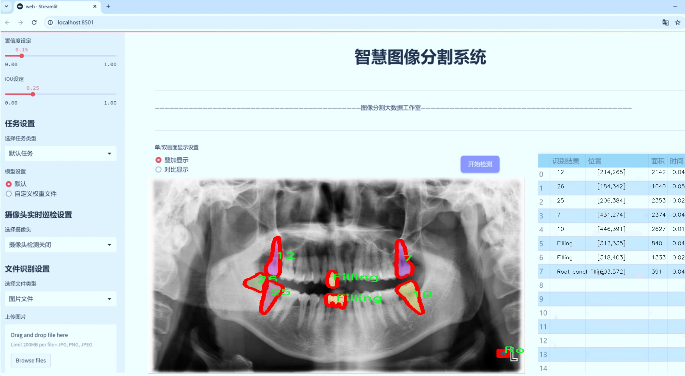
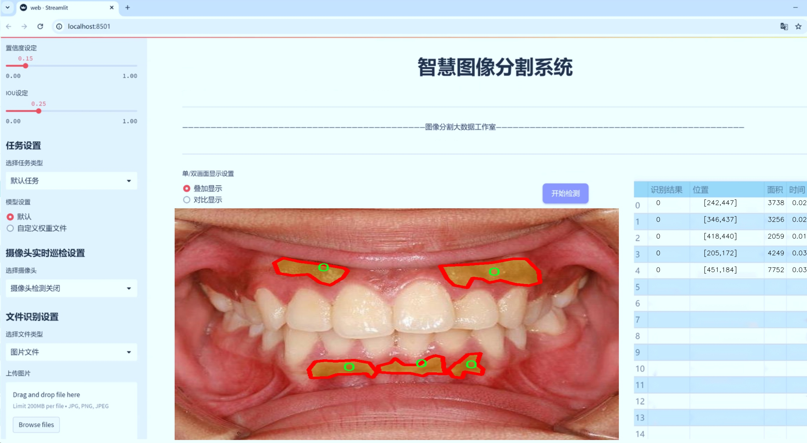
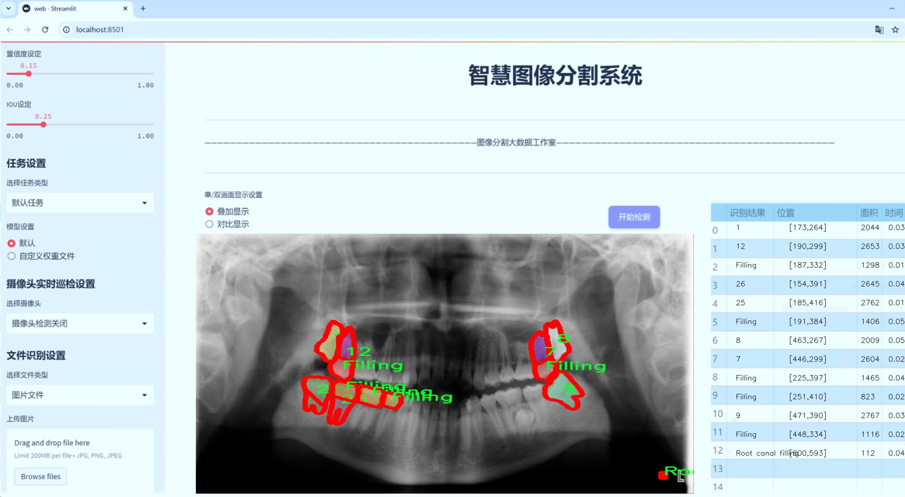
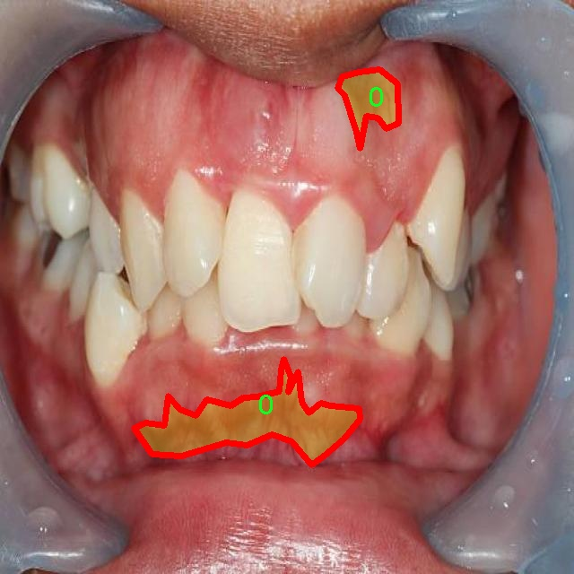
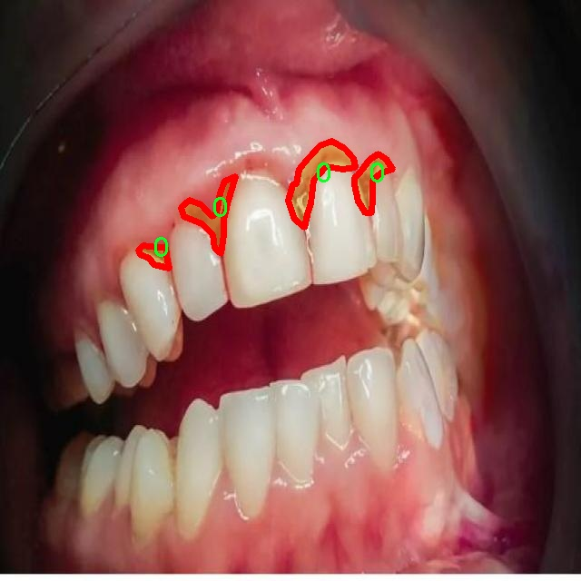
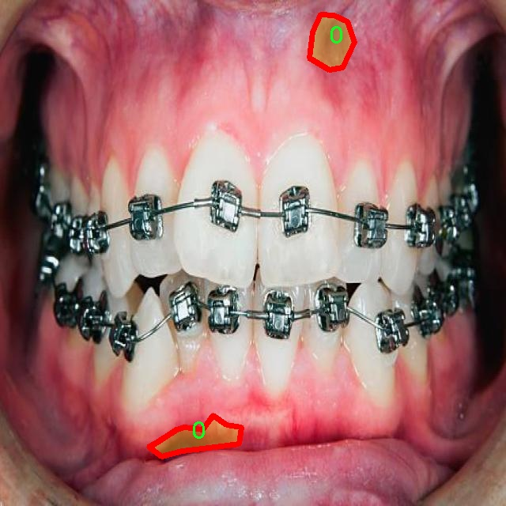
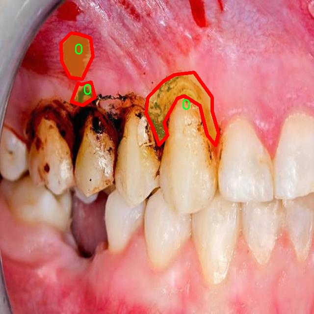
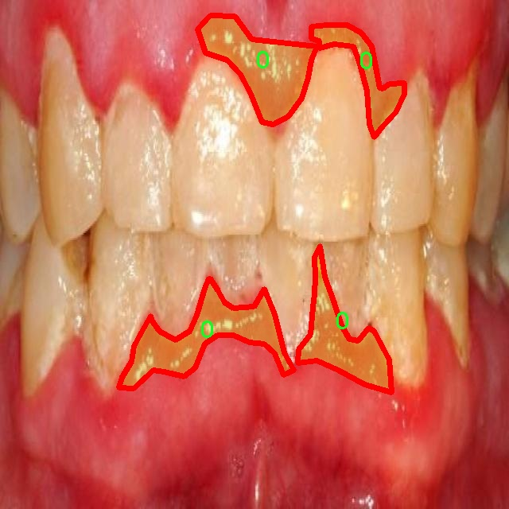

# 口腔牙龈健康状况医疗图像分割系统： yolov8-seg-GFPN

### 1.研究背景与意义

[参考博客](https://gitee.com/YOLOv8_YOLOv11_Segmentation_Studio/projects)

[博客来源](https://kdocs.cn/l/cszuIiCKVNis)

研究背景与意义

随着口腔医学的快速发展，牙龈健康状况的监测与评估变得愈发重要。牙龈疾病不仅影响口腔健康，还与全身健康密切相关，诸如心血管疾病、糖尿病等慢性病的发生率与牙龈健康状况存在显著关联。因此，及时、准确地识别和分析口腔内的病变，尤其是牙龈的健康状况，对于早期干预和治疗具有重要意义。传统的口腔检查方法往往依赖于医生的主观判断，容易受到个人经验和技术水平的影响，导致诊断结果的差异性和不确定性。为了解决这一问题，计算机视觉和深度学习技术的应用为口腔医学提供了新的解决方案。

近年来，YOLO（You Only Look Once）系列模型在目标检测和图像分割领域取得了显著的进展，尤其是YOLOv8模型，其在速度和精度上都表现出色。通过对YOLOv8模型的改进，结合口腔医疗图像的特征，可以实现对牙龈健康状况的高效、准确的自动化分析。具体而言，基于改进YOLOv8的口腔牙龈健康状况医疗图像分割系统，能够在复杂的口腔图像中快速定位和分割出牙龈、牙齿及其他相关结构，为后续的诊断和治疗提供可靠的数据支持。

本研究所使用的数据集包含9600幅口腔图像，涵盖了84个类别，包括各种类型的牙齿、牙龈、填充物、植体等。这些丰富的类别信息不仅为模型的训练提供了多样化的样本，也为后续的分类和分析提供了基础。通过对这些图像的深度学习处理，研究能够有效提取出牙龈健康状况的特征，进而实现对牙龈疾病的早期识别和分类。这种基于深度学习的自动化系统，不仅能够提高诊断的准确性，还能显著降低医生的工作负担，提高口腔医疗服务的效率。

此外，随着口腔健康意识的提高，公众对牙龈健康的关注度逐渐上升。通过构建这样一个智能化的口腔牙龈健康状况医疗图像分割系统，能够为医生提供强有力的技术支持，同时也为患者提供更为直观和易懂的健康信息。这种技术的推广应用，必将推动口腔医学的数字化转型，提升整体医疗服务水平。

综上所述，基于改进YOLOv8的口腔牙龈健康状况医疗图像分割系统，不仅具有重要的学术价值，也具有广泛的应用前景。通过深入研究和开发这一系统，将为口腔健康的早期预警、监测和管理提供新的思路和方法，推动口腔医学的进一步发展。

### 2.图片演示







注意：本项目提供完整的训练源码数据集和训练教程,由于此博客编辑较早,暂不提供权重文件（best.pt）,需要按照6.训练教程进行训练后实现上图效果。

### 3.视频演示

[3.1 视频演示](https://www.bilibili.com/video/BV1TgUNYpEDw/)

### 4.数据集信息

##### 4.1 数据集类别数＆类别名

nc: 84
names: ['0', '1', '10', '11', '12', '13', '14', '15', '16', '17', '18', '19', '2', '20', '21', '22', '23', '24', '25', '26', '27', '28', '29', '3', '30', '31', '32', '3M ESPE Implant', '4', '5', '6', '7', '8', '9', 'AGS Medikal Implant', 'AMerOss Implant', 'Amalgam filling', 'Anthogyr Implant', 'Bicon Implant', 'BioHorizons Implant', 'BioLife Implant', 'Biomet 3i Implant', 'Blue Sky Bio Implant', 'Camlog Implant', 'Caries', 'Composite filling', 'Cowellmedi Implant', 'Crown', 'DENTSPLY Implant', 'Dentatus Implant', 'Dentis Implant', 'Dentium Implant', 'Euroteknika Implant', 'Filling', 'Frontier Implant', 'Hiossen Implant', 'Implant Direct', 'Implant', 'Keystone Dental Implant', 'Leone Implant', 'MIS Implant', 'Mandible', 'Maxilla', 'Megagen Implant', 'Neodent Implant', 'Neoss Implant', 'Nobel Biocare Implant', 'Novodent Implant', 'NucleOSS Implant', 'OCO Biomedical Implant', 'OsseoLink Implant', 'Osstem Implant', 'Prefabricated metal post', 'Retained root', 'Root canal filling', 'Root canal obturation', 'Sterngold Implant', 'Straumann Implant', 'Titan Implant Implant', 'Zimmer Implant', 'caries', 'object', 'restoration', 'tooth']


##### 4.2 数据集信息简介

数据集信息展示

在本研究中，我们使用了名为“mouth”的数据集，以改进YOLOv8-seg在口腔牙龈健康状况医疗图像分割系统中的应用。该数据集包含了丰富的口腔健康相关图像，涵盖了多种牙科疾病、治疗方法和牙科材料的视觉信息，旨在为医疗图像处理提供坚实的基础。数据集的类别数量达到84，涵盖了广泛的口腔健康相关元素，能够为模型训练提供多样化的样本。

数据集中包含的类别从基本的牙齿结构到复杂的牙科植入物，均有详细标注。例如，类别包括“Mandible”（下颌骨）和“Maxilla”（上颌骨），这些基础解剖结构的识别对于理解口腔健康至关重要。此外，数据集中还包含了多种类型的牙科植入物，如“3M ESPE Implant”、“Nobel Biocare Implant”、“Straumann Implant”等，这些类别不仅反映了当前牙科技术的多样性，也为模型提供了识别不同植入物的能力。

在疾病方面，数据集同样表现出色。类别如“Caries”（龋齿）和“Composite filling”（复合树脂填充）能够帮助模型学习如何识别和区分健康与病变的牙齿结构。这种细致的分类不仅提升了模型的分割精度，也为临床医生提供了更为准确的诊断支持。

此外，数据集中还包括了“Restoration”（修复）和“Filling”（填充）等类别，这些都是口腔治疗中常见的操作，能够帮助模型学习如何识别不同的治疗方式及其效果。通过对这些类别的训练，模型将能够更好地理解口腔内的变化，并提供更为精确的分割结果。

值得注意的是，数据集中的类别命名采用了数字和描述相结合的方式，如“0”、“1”、“2”等数字类目与“Crown”（牙冠）、“Root canal filling”（根管填充）等具体描述相结合，使得数据集在结构上既清晰又易于理解。这种设计不仅方便了数据的标注和管理，也为后续的模型训练提供了良好的数据基础。

总之，“mouth”数据集以其丰富的类别和详尽的标注，为改进YOLOv8-seg在口腔牙龈健康状况医疗图像分割系统中的应用提供了重要支持。通过对这些多样化的口腔健康相关图像的训练，模型将能够在实际应用中实现更高的准确性和可靠性，为口腔医学的研究和临床实践提供强有力的技术支持。











### 5.项目依赖环境部署教程（零基础手把手教学）

[5.1 环境部署教程链接（零基础手把手教学）](https://www.bilibili.com/video/BV1jG4Ve4E9t/?vd_source=bc9aec86d164b67a7004b996143742dc)


[5.2 安装Python虚拟环境创建和依赖库安装视频教程链接（零基础手把手教学）](https://www.bilibili.com/video/BV1nA4VeYEze/?vd_source=bc9aec86d164b67a7004b996143742dc)

### 6.手把手YOLOV8-seg训练视频教程（零基础手把手教学）

[6.1 手把手YOLOV8-seg训练视频教程（零基础小白有手就能学会）](https://www.bilibili.com/video/BV1cA4VeYETe/?vd_source=bc9aec86d164b67a7004b996143742dc)


按照上面的训练视频教程链接加载项目提供的数据集，运行train.py即可开始训练



     Epoch   gpu_mem       box       obj       cls    labels  img_size
     1/200     0G   0.01576   0.01955  0.007536        22      1280: 100%|██████████| 849/849 [14:42<00:00,  1.04s/it]
               Class     Images     Labels          P          R     mAP@.5 mAP@.5:.95: 100%|██████████| 213/213 [01:14<00:00,  2.87it/s]
                 all       3395      17314      0.994      0.957      0.0957      0.0843

     Epoch   gpu_mem       box       obj       cls    labels  img_size
     2/200     0G   0.01578   0.01923  0.007006        22      1280: 100%|██████████| 849/849 [14:44<00:00,  1.04s/it]
               Class     Images     Labels          P          R     mAP@.5 mAP@.5:.95: 100%|██████████| 213/213 [01:12<00:00,  2.95it/s]
                 all       3395      17314      0.996      0.956      0.0957      0.0845

     Epoch   gpu_mem       box       obj       cls    labels  img_size
     3/200     0G   0.01561    0.0191  0.006895        27      1280: 100%|██████████| 849/849 [10:56<00:00,  1.29it/s]
               Class     Images     Labels          P          R     mAP@.5 mAP@.5:.95: 100%|███████   | 187/213 [00:52<00:00,  4.04it/s]
                 all       3395      17314      0.996      0.957      0.0957      0.0845


### 7.50+种全套YOLOV8-seg创新点加载调参实验视频教程（一键加载写好的改进模型的配置文件）

[7.1 50+种全套YOLOV8-seg创新点加载调参实验视频教程（一键加载写好的改进模型的配置文件）](https://www.bilibili.com/video/BV1Hw4VePEXv/?vd_source=bc9aec86d164b67a7004b996143742dc)

### YOLOV8-seg算法简介

原始YOLOv8-seg算法原理

YOLOv8-seg算法是基于YOLOv8模型的进一步发展，专注于图像分割任务，旨在实现高效的目标检测与分割。YOLOv8模型由Ultralytics团队在YOLOv5的基础上进行了多项改进，结合了近两年内的最新研究成果，展现出卓越的性能。该模型的核心结构包括输入层、主干网络、颈部网络和检测头，其中每个部分都经过精心设计，以提高模型的精度和速度。

在输入层，YOLOv8-seg采用了Mosaic数据增强技术，尽管这种方法能够增强模型的鲁棒性和泛化能力，但Ultralytics团队在训练的最后10个epoch中停止使用该技术，以避免对数据真实分布的干扰。这一决策体现了对数据质量的重视，确保模型在真实场景中的表现更为可靠。

主干网络的设计是YOLOv8-seg的一大亮点。与YOLOv5相比，YOLOv8引入了C2f模块，取代了传统的C3模块。C2f模块在设计上吸收了YOLOv7中ELAN的思想，增加了跳层连接的数量，这样不仅丰富了梯度流信息，还有效地保持了模型的轻量化特性。通过这种结构，YOLOv8-seg能够在特征提取过程中更好地捕捉多层次的信息，进而提升分割的精度。此外，SPPF模块的保留也确保了特征图处理的高效性，减少了执行时间，同时保持了输出特征的质量。

在颈部网络中，YOLOv8-seg同样将所有的C3模块替换为C2f模块，进一步提升了特征融合的能力。通过删除两处上采样之前的卷积连接层，模型的复杂度得以降低，进而提高了推理速度。这种设计思路使得YOLOv8-seg在处理复杂场景时，能够快速而准确地进行目标分割。

检测头的设计是YOLOv8-seg的另一大创新。该模型采用了YOLOX中引入的解耦头结构，将分类和定位任务分为两条并行的分支。这种分离的设计使得分类任务能够更专注于特征图中的类别相似性，而定位任务则更关注边界框与真实框之间的关系。这种结构的引入不仅加快了模型的收敛速度，还显著提高了预测的精度。

YOLOv8-seg还引入了无锚框结构，直接预测目标的中心位置。这一设计的优势在于简化了目标检测的过程，减少了对先验框的依赖，使得模型在处理不同尺寸和形状的目标时更加灵活。此外，模型中引入的任务对齐学习（TAL）机制，通过分类分数和IOU的高次幂乘积来衡量任务对齐程度，进一步提升了分类和定位的性能。

在性能方面，YOLOv8-seg在COCO数据集上的表现令人瞩目。通过对比不同尺寸的模型，YOLOv8-seg在保持参数量相对稳定的情况下，显著提高了mAP（mean Average Precision）值，尤其是在IOU从50%到95%范围内的表现尤为突出。这一结果表明，YOLOv8-seg在精度和速度之间找到了良好的平衡，适合于实时应用场景。

综上所述，YOLOv8-seg算法在YOLOv8的基础上，通过对网络结构的优化和创新，显著提升了目标检测与分割的性能。其轻量化设计、有效的特征融合机制以及解耦头结构的引入，使得YOLOv8-seg在处理复杂图像时展现出卓越的能力。这些改进不仅增强了模型的实时性和准确性，也为后续的研究和应用提供了广阔的空间，尤其是在机器人视觉、自动驾驶和智能监控等领域，YOLOv8-seg都展现出极大的应用潜力。随着对YOLOv8-seg算法的深入研究，未来有望在更多实际场景中实现更高效的目标检测与分割任务。


### 9.系统功能展示（检测对象为举例，实际内容以本项目数据集为准）

图9.1.系统支持检测结果表格显示

  图9.2.系统支持置信度和IOU阈值手动调节

  图9.3.系统支持自定义加载权重文件best.pt(需要你通过步骤5中训练获得)

  图9.4.系统支持摄像头实时识别

  图9.5.系统支持图片识别

  图9.6.系统支持视频识别

  图9.7.系统支持识别结果文件自动保存

  图9.8.系统支持Excel导出检测结果数据


### 10.50+种全套YOLOV8-seg创新点原理讲解（非科班也可以轻松写刊发刊，V11版本正在科研待更新）

#### 10.1 由于篇幅限制，每个创新点的具体原理讲解就不一一展开，具体见下列网址中的创新点对应子项目的技术原理博客网址【Blog】：


[10.1 50+种全套YOLOV8-seg创新点原理讲解链接](https://gitee.com/qunmasj/good)

#### 10.2 部分改进模块原理讲解(完整的改进原理见上图和技术博客链接)【如果此小节的图加载失败可以通过CSDN或者Github搜索该博客的标题访问原始博客，原始博客图片显示正常】

### Gold-YOLO简介
YOLO再升级：华为诺亚提出Gold-YOLO，聚集-分发机制打造新SOTA
在过去的几年中，YOLO系列模型已经成为实时目标检测领域的领先方法。许多研究通过修改架构、增加数据和设计新的损失函数，将基线推向了更高的水平。然而以前的模型仍然存在信息融合问题，尽管特征金字塔网络（FPN）和路径聚合网络（PANet）已经在一定程度上缓解了这个问题。因此，本研究提出了一种先进的聚集和分发机制（GD机制），该机制通过卷积和自注意力操作实现。这种新设计的模型被称为Gold-YOLO，它提升了多尺度特征融合能力，在所有模型尺度上实现了延迟和准确性的理想平衡。此外，本文首次在YOLO系列中实现了MAE风格的预训练，使得YOLO系列模型能够从无监督预训练中受益。Gold-YOLO-N在COCO val2017数据集上实现了出色的39.9% AP，并在T4 GPU上实现了1030 FPS，超过了之前的SOTA模型YOLOv6-3.0-N，其FPS相似，但性能提升了2.4%。


#### Gold-YOLO


YOLO系列的中间层结构采用了传统的FPN结构，其中包含多个分支用于多尺度特征融合。然而，它只充分融合来自相邻级别的特征，对于其他层次的信息只能间接地进行“递归”获取。

传统的FPN结构在信息传输过程中存在丢失大量信息的问题。这是因为层之间的信息交互仅限于中间层选择的信息，未被选择的信息在传输过程中被丢弃。这种情况导致某个Level的信息只能充分辅助相邻层，而对其他全局层的帮助较弱。因此，整体上信息融合的有效性可能受到限制。
为了避免在传输过程中丢失信息，本文采用了一种新颖的“聚集和分发”机制（GD），放弃了原始的递归方法。该机制使用一个统一的模块来收集和融合所有Level的信息，并将其分发到不同的Level。通过这种方式，作者不仅避免了传统FPN结构固有的信息丢失问题，还增强了中间层的部分信息融合能力，而且并没有显著增加延迟。


# 8.低阶聚合和分发分支 Low-stage gather-and-distribute branch
从主干网络中选择输出的B2、B3、B4、B5特征进行融合，以获取保留小目标信息的高分辨率特征。


低阶特征对齐模块 (Low-stage feature alignment module)： 在低阶特征对齐模块（Low-FAM）中，采用平均池化（AvgPool）操作对输入特征进行下采样，以实现统一的大小。通过将特征调整为组中最小的特征大小（ R B 4 = 1 / 4 R ） （R_{B4} = 1/4R）（R 
B4 =1/4R），我们得到对齐后的特征F a l i g n F_{align}F align 。低阶特征对齐技术确保了信息的高效聚合，同时通过变换器模块来最小化后续处理的计算复杂性。其中选择 R B 4 R_{B4}R B4 作为特征对齐的目标大小主要基于保留更多的低层信息的同时不会带来较大的计算延迟。
低阶信息融合模块(Low-stage information fusion module)： 低阶信息融合模块（Low-IFM）设计包括多层重新参数化卷积块（RepBlock）和分裂操作。具体而言，RepBlock以F a l i g n ( c h a n n e l = s u m ( C B 2 ， C B 3 ， C B 4 ， C B 5 ) ) F_{align} (channel= sum(C_{B2}，C_{B3}，C_{B4}，C_{B5}))F align (channel=sum(C B2 ，C B3 ，C B4 ，C B5 )作为输入，并生成F f u s e ( c h a n n e l = C B 4 + C B 5 ) F_{fuse} (channel= C_{B4} + C_{B5})F fuse (channel=C B4 +C B5 )。其中中间通道是一个可调整的值（例如256），以适应不同的模型大小。由RepBlock生成的特征随后在通道维度上分裂为F i n j P 3 Finj_P3Finj P 3和F i n j P 4 Finj_P4Finj P 4，然后与不同级别的特征进行融合。


# 8.高阶聚合和分发分支 High-stage gather-and-distribute branch
高级全局特征对齐模块（High-GD）将由低级全局特征对齐模块（Low-GD）生成的特征{P3, P4, P5}进行融合。


高级特征对齐模块(High-stage feature alignment module)： High-FAM由avgpool组成，用于将输入特征的维度减小到统一的尺寸。具体而言，当输入特征的尺寸为{R P 3 R_{P3}R P3 , R P 4 R_{P4}R P4 , R P 5 R_{P 5}R P5 }时，avgpool将特征尺寸减小到该特征组中最小的尺寸（R P 5 R_{P5}R P5  = 1/8R）。由于transformer模块提取了高层次的信息，池化操作有助于信息聚合，同时降低了transformer模块后续步骤的计算需求。

Transformer融合模块由多个堆叠的transformer组成，transformer块的数量为L。每个transformer块包括一个多头注意力块、一个前馈网络（FFN）和残差连接。采用与LeViT相同的设置来配置多头注意力块，使用16个通道作为键K和查询Q的头维度，32个通道作为值V的头维度。为了加速推理过程，将层归一化操作替换为批归一化，并将所有的GELU激活函数替换为ReLU。为了增强变换器块的局部连接，在两个1x1卷积层之间添加了一个深度卷积层。同时，将FFN的扩展因子设置为2，以在速度和计算成本之间取得平衡。

信息注入模块(Information injection module)： 高级全局特征对齐模块（High-GD）中的信息注入模块与低级全局特征对齐模块（Low-GD）中的相同。在高级阶段，局部特征（Flocal）等于Pi，因此公式如下所示：


### 增强的跨层信息流动 Enhanced cross-layer information flow
为了进一步提升性能，从YOLOv8 中的PAFPN模块中得到启发，引入了Inject-LAF模块。该模块是注入模块的增强版，包括了一个轻量级相邻层融合（LAF）模块，该模块被添加到注入模块的输入位置。为了在速度和准确性之间取得平衡，设计了两个LAF模型：LAF低级模型和LAF高级模型，分别用于低级注入（合并相邻两层的特征）和高级注入（合并相邻一层的特征）。它们的结构如图5(b)所示。为了确保来自不同层级的特征图与目标大小对齐，在实现中的两个LAF模型仅使用了三个操作符：双线性插值（上采样过小的特征）、平均池化（下采样过大的特征）和1x1卷积（调整与目标通道不同的特征）。模型中的LAF模块与信息注入模块的结合有效地平衡了准确性和速度之间的关系。通过使用简化的操作，能够增加不同层级之间的信息流路径数量，从而提高性能而不显著增加延迟。


### 11.项目核心源码讲解（再也不用担心看不懂代码逻辑）

#### 11.1 log.py

以下是经过简化和注释的核心代码部分：

```python
import os
import cv2
import pandas as pd
from PIL import Image

def save_chinese_image(file_path, image_array):
    """
    保存带有中文路径的图片文件

    参数：
    file_path (str): 图片的保存路径，应包含中文字符
    image_array (numpy.ndarray): 要保存的 OpenCV 图像（即 numpy 数组）
    """
    try:
        # 将 OpenCV 图片转换为 Pillow Image 对象
        image = Image.fromarray(cv2.cvtColor(image_array, cv2.COLOR_BGR2RGB))
        # 使用 Pillow 保存图片文件
        image.save(file_path)
        print(f"成功保存图像到: {file_path}")
    except Exception as e:
        print(f"保存图像失败: {str(e)}")

class LogTable:
    def __init__(self, csv_file_path=None):
        """
        初始化类实例，尝试从CSV文件加载数据。

        参数：
        csv_file_path (str): 保存初始数据的CSV文件路径。
        """
        self.csv_file_path = csv_file_path
        columns = ['文件路径', '识别结果', '位置', '面积', '时间']
        
        # 尝试从CSV文件加载数据，如果失败则创建一个空的DataFrame
        if csv_file_path and os.path.exists(csv_file_path):
            self.data = pd.read_csv(csv_file_path, encoding='utf-8')
        else:
            self.data = pd.DataFrame(columns=columns)

    def add_log_entry(self, file_path, recognition_result, position, confidence, time_spent):
        """
        向日志中添加一条新记录。

        参数：
        file_path (str): 文件路径
        recognition_result (str): 识别结果
        position (str): 位置
        confidence (float): 置信度
        time_spent (float): 用时（通常是秒或毫秒）

        返回：
        None
        """
        # 创建新的数据行
        new_entry = pd.DataFrame([[file_path, recognition_result, position, confidence, time_spent]],
                                 columns=['文件路径', '识别结果', '位置', '面积', '时间'])
        # 将新行添加到DataFrame中
        self.data = pd.concat([new_entry, self.data]).reset_index(drop=True)

    def save_to_csv(self):
        """
        将更新后的DataFrame保存到CSV文件。
        """
        self.data.to_csv(self.csv_file_path, index=False, encoding='utf-8', mode='a', header=False)

```

### 代码注释说明：

1. **save_chinese_image**: 该函数用于保存包含中文路径的图像文件。它将OpenCV格式的图像转换为Pillow格式，并尝试保存到指定路径。如果保存失败，会捕获异常并打印错误信息。

2. **LogTable类**:
   - **__init__**: 初始化类实例，尝试从指定的CSV文件加载数据。如果文件不存在，则创建一个空的DataFrame。
   - **add_log_entry**: 向日志中添加一条新记录。接收文件路径、识别结果、位置、置信度和用时等信息，并将其存储在DataFrame中。
   - **save_to_csv**: 将当前的DataFrame保存到CSV文件中，使用追加模式。

通过这些核心部分，代码实现了图像的保存和日志记录功能，能够处理中文路径和CSV文件的读写。

这个程序文件 `log.py` 是一个用于处理图像和记录识别结果的 Python 脚本。它主要依赖于一些常用的库，如 OpenCV、Pandas 和 Pillow，来实现图像的保存、结果的记录和数据的管理。

程序首先导入了必要的库，包括处理文件路径的 `os`、时间处理的 `time`、图像处理的 `cv2`、数据处理的 `pandas`、图像处理的 `PIL` 和数值计算的 `numpy`，以及用于时间戳的 `datetime`。

接下来，定义了一个函数 `save_chinese_image`，该函数用于保存带有中文路径的图像文件。它接受一个文件路径和一个图像数组作为参数。函数内部首先将 OpenCV 格式的图像转换为 Pillow 的图像对象，然后尝试保存该图像，并在控制台输出保存结果。

接着，定义了一个 `ResultLogger` 类，用于记录识别结果。该类初始化时创建一个空的 DataFrame，包含识别结果、位置、面积和时间等列。`concat_results` 方法用于将新的检测结果添加到 DataFrame 中，形成一个更新后的结果表。

然后，定义了一个 `LogTable` 类，负责管理日志记录和图像保存。初始化时，它尝试从指定的 CSV 文件加载数据，如果文件不存在，则创建一个空的 DataFrame。该类包含多个方法，包括 `add_frames` 用于添加图像和检测信息，`clear_frames` 用于清空保存的图像，`save_frames_file` 用于保存图像或视频，`add_log_entry` 用于向日志中添加新记录，`clear_data` 用于清空数据，`save_to_csv` 用于将数据保存到 CSV 文件，以及 `update_table` 用于更新表格显示最新的记录。

在 `save_frames_file` 方法中，程序根据保存的图像数量决定是保存为单张图片还是视频。如果只有一张图像，则保存为 PNG 格式；如果有多张图像，则保存为 AVI 格式的视频文件。该方法还会生成一个带有时间戳的文件名，确保文件名的唯一性。

整体来看，这个程序文件实现了图像的保存、识别结果的记录和管理，适用于需要处理图像数据并记录相关信息的应用场景。

#### 11.2 ultralytics\engine\model.py

以下是代码中最核心的部分，并附上详细的中文注释：

```python
class Model(nn.Module):
    """
    模型基类，用于统一所有模型的API。

    参数:
        model (str, Path): 要加载或创建的模型文件路径。
        task (Any, optional): YOLO模型的任务类型。默认为None。

    属性:
        predictor (Any): 预测器对象。
        model (Any): 模型对象。
        trainer (Any): 训练器对象。
        task (str): 模型任务类型。
        ckpt (Any): 如果模型是从*.pt文件加载的，则为检查点对象。
        cfg (str): 如果从*.yaml文件加载，则为模型配置。
        ckpt_path (str): 检查点文件路径。
        overrides (dict): 训练器对象的覆盖参数。
        metrics (Any): 用于度量的数据。
    """

    def __init__(self, model: Union[str, Path] = 'yolov8n.pt', task=None) -> None:
        """
        初始化YOLO模型。

        参数:
            model (Union[str, Path], optional): 要加载或创建的模型的路径或名称。默认为'yolov8n.pt'。
            task (Any, optional): YOLO模型的任务类型。默认为None。
        """
        super().__init__()
        self.predictor = None  # 预测器对象
        self.model = None  # 模型对象
        self.trainer = None  # 训练器对象
        self.task = task  # 任务类型
        model = str(model).strip()  # 去除模型名称的空格

        # 检查是否为Ultralytics HUB模型
        if self.is_hub_model(model):
            from ultralytics.hub.session import HUBTrainingSession
            self.session = HUBTrainingSession(model)  # 创建HUB训练会话
            model = self.session.model_file  # 获取模型文件

        # 加载或创建新的YOLO模型
        suffix = Path(model).suffix  # 获取模型文件后缀
        if suffix in ('.yaml', '.yml'):
            self._new(model, task)  # 从配置文件创建新模型
        else:
            self._load(model, task)  # 从权重文件加载模型

    def predict(self, source=None, stream=False, predictor=None, **kwargs):
        """
        使用YOLO模型进行预测。

        参数:
            source (str | int | PIL | np.ndarray): 要进行预测的图像源。
            stream (bool): 是否流式传输预测结果。默认为False。
            predictor (BasePredictor): 自定义预测器。
            **kwargs : 传递给预测器的其他关键字参数。

        返回:
            (List[ultralytics.engine.results.Results]): 预测结果。
        """
        if source is None:
            source = ASSETS  # 如果没有提供源，则使用默认资产
        custom = {'conf': 0.25}  # 方法默认参数
        args = {**self.overrides, **custom, **kwargs, 'mode': 'predict'}  # 合并参数
        if not self.predictor:
            self.predictor = (predictor or self._smart_load('predictor'))(overrides=args)  # 加载预测器
            self.predictor.setup_model(model=self.model)  # 设置模型
        return self.predictor(source=source, stream=stream)  # 返回预测结果

    def _load(self, weights: str, task=None):
        """
        从权重文件加载模型并推断任务类型。

        参数:
            weights (str): 要加载的模型检查点。
            task (str | None): 模型任务。
        """
        self.model, self.ckpt = attempt_load_one_weight(weights)  # 尝试加载权重
        self.task = self.model.args['task']  # 获取任务类型
        self.overrides['model'] = weights  # 更新覆盖参数

    def is_hub_model(self, model):
        """检查提供的模型是否为HUB模型。"""
        return model.startswith(f'{HUB_WEB_ROOT}/models/')  # 检查模型是否以HUB网址开头

    def _new(self, cfg: str, task=None):
        """
        初始化新模型并推断任务类型。

        参数:
            cfg (str): 模型配置文件。
            task (str | None): 模型任务。
        """
        cfg_dict = yaml_model_load(cfg)  # 加载配置文件
        self.task = task or guess_model_task(cfg_dict)  # 推断任务类型
        self.model = self._smart_load('model')(cfg_dict)  # 创建模型

    def _smart_load(self, key):
        """加载模型/训练器/验证器/预测器。"""
        try:
            return self.task_map[self.task][key]  # 根据任务类型加载相应的组件
        except Exception as e:
            raise NotImplementedError("该任务类型尚不支持该操作。") from e

    @property
    def task_map(self):
        """任务到模型、训练器、验证器和预测器类的映射。"""
        raise NotImplementedError('请为您的模型提供任务映射！')
```

### 代码说明
1. **Model类**: 这是一个YOLO模型的基类，负责模型的初始化、加载和预测等功能。
2. **初始化方法**: 在初始化时，检查模型类型（HUB模型或权重文件），并根据类型加载模型。
3. **预测方法**: 该方法使用指定的源进行预测，并返回预测结果。
4. **加载方法**: 从权重文件加载模型并推断任务类型。
5. **任务映射**: 提供一个任务到模型、训练器、验证器和预测器的映射，但具体实现需要子类提供。

这些核心部分和注释可以帮助理解YOLO模型的基本结构和功能。

这个程序文件是一个用于实现YOLO（You Only Look Once）模型的基础类，主要用于统一各种模型的API。文件中包含了模型的初始化、加载、预测、训练、验证等功能，提供了一个完整的框架来使用YOLO模型进行目标检测。

在类的初始化方法中，首先会检查传入的模型路径或名称，并根据不同的情况进行处理。如果模型是来自Ultralytics HUB或Triton Server，程序会相应地进行初始化。接着，根据模型的后缀名来判断是加载已有的模型权重还是创建新的模型。如果是配置文件（如.yaml），则调用_new方法进行初始化；如果是权重文件（如.pt），则调用_load方法加载模型。

类中定义了多个方法。__call__方法是一个重载，使得可以通过调用类的实例来执行预测。_new和_load方法分别用于创建新模型和加载已有模型，_check_is_pytorch_model方法用于检查当前模型是否为PyTorch模型。

predict方法是进行目标检测的核心方法，接受多种输入源（如文件路径、视频流等），并返回预测结果。track方法用于在输入源上进行目标跟踪，val方法用于在给定数据集上验证模型的性能，train方法则用于训练模型。

此外，类中还包含了一些辅助方法，如reset_weights用于重置模型参数，info用于记录模型信息，fuse用于加速推理，export用于导出模型，benchmark用于对模型进行基准测试等。

类的属性包括模型的任务类型、检查点、配置、回调函数等，提供了灵活的方式来管理和使用模型。通过这些方法和属性，用户可以方便地进行模型的训练、验证、预测和导出等操作。

总的来说，这个文件为YOLO模型的使用提供了一个高层次的接口，封装了许多底层的实现细节，使得用户可以更专注于模型的应用而非具体的实现。

#### 11.3 ultralytics\nn\modules\head.py

以下是经过简化并注释的代码，保留了最核心的部分：

```python
import torch
import torch.nn as nn
from .conv import Conv
from .utils import bias_init_with_prob, linear_init_

class Detect(nn.Module):
    """YOLOv8 检测头，用于目标检测模型。"""
    
    def __init__(self, nc=80, ch=()):
        """初始化 YOLOv8 检测层，指定类别数和通道数。"""
        super().__init__()
        self.nc = nc  # 类别数
        self.nl = len(ch)  # 检测层数
        self.reg_max = 16  # DFL 通道数
        self.no = nc + self.reg_max * 4  # 每个锚点的输出数
        self.stride = torch.zeros(self.nl)  # 在构建时计算的步幅
        c2, c3 = max((16, ch[0] // 4, self.reg_max * 4)), max(ch[0], min(self.nc, 100))  # 通道数
        
        # 定义卷积层
        self.cv2 = nn.ModuleList(
            nn.Sequential(Conv(x, c2, 3), Conv(c2, c2, 3), nn.Conv2d(c2, 4 * self.reg_max, 1)) for x in ch)
        self.cv3 = nn.ModuleList(nn.Sequential(Conv(x, c3, 3), Conv(c3, c3, 3), nn.Conv2d(c3, self.nc, 1)) for x in ch)
        self.dfl = DFL(self.reg_max) if self.reg_max > 1 else nn.Identity()  # DFL 层

    def forward(self, x):
        """连接并返回预测的边界框和类别概率。"""
        shape = x[0].shape  # BCHW 格式
        for i in range(self.nl):
            x[i] = torch.cat((self.cv2[i](x[i]), self.cv3[i](x[i])), 1)  # 通过卷积层处理输入
        x_cat = torch.cat([xi.view(shape[0], self.no, -1) for xi in x], 2)  # 连接所有层的输出
        
        # 分割边界框和类别
        box, cls = x_cat.split((self.reg_max * 4, self.nc), 1)
        dbox = dist2bbox(self.dfl(box), self.anchors.unsqueeze(0), xywh=True, dim=1) * self.strides  # 计算边界框
        
        # 返回最终输出
        return torch.cat((dbox, cls.sigmoid()), 1)  # 连接边界框和类别概率

    def bias_init(self):
        """初始化 Detect() 的偏置，警告：需要步幅可用。"""
        for a, b, s in zip(self.cv2, self.cv3, self.stride):  # 遍历卷积层
            a[-1].bias.data[:] = 1.0  # 边界框偏置
            b[-1].bias.data[:self.nc] = math.log(5 / self.nc / (640 / s) ** 2)  # 类别偏置

# 其他类（Segment, Pose, Classify, RTDETRDecoder）省略，类似于 Detect 类的结构
```

### 代码注释说明：
1. **Detect 类**：这是 YOLOv8 的检测头，负责处理输入并生成边界框和类别概率。
2. **初始化方法 `__init__`**：定义了类别数、检测层数、输出数等，并初始化卷积层。
3. **前向传播方法 `forward`**：处理输入，生成边界框和类别概率，并返回最终结果。
4. **偏置初始化方法 `bias_init`**：初始化模型的偏置，以便于训练时更快收敛。

其他类（如 `Segment`, `Pose`, `Classify`, `RTDETRDecoder`）的结构与 `Detect` 类相似，省略了具体实现，主要关注于它们的功能和参数设置。

这个程序文件是Ultralytics YOLO（You Only Look Once）模型的一部分，主要实现了模型的头部模块，包含了不同类型的检测、分割、姿态估计和分类功能。代码使用了PyTorch框架，定义了一系列的神经网络模块。

首先，文件导入了一些必要的库和工具，包括数学库、PyTorch的神经网络模块、初始化方法以及Ultralytics的工具函数。接着，定义了多个类，每个类对应YOLO模型的不同功能。

`Detect`类是YOLOv8的检测头，负责生成边界框和类别概率。它的构造函数接受类别数量和通道数作为参数，并初始化了一些重要的参数，如输出的数量、卷积层等。在前向传播方法中，输入的特征图经过卷积处理后，生成边界框和类别的预测。如果模型处于训练状态，直接返回预测结果；如果是推理阶段，还会动态生成锚框并进行坐标转换。

`Segment`类继承自`Detect`类，专门用于分割任务。它增加了对掩码和原型的处理，并在前向传播中返回掩码系数和原型信息。

`Pose`类同样继承自`Detect`类，专注于关键点检测。它的构造函数定义了关键点的形状，并在前向传播中返回关键点的预测结果。

`Classify`类实现了分类头，将输入的特征图通过卷积和全局平均池化处理，最终输出类别概率。它的设计允许在训练和推理阶段使用不同的处理方式。

`RTDETRDecoder`类是一个实时可变形Transformer解码器，结合了Transformer架构和可变形卷积，负责对输入特征进行解码，生成边界框和分类分数。它的构造函数接受多个参数，定义了输入投影、Transformer模块、去噪部分等。前向传播方法中，首先处理输入特征，然后通过解码器生成最终的预测结果。

整个文件通过模块化的设计，使得不同的功能可以被独立实现和扩展，适应不同的计算机视觉任务。每个类的实现都注重了参数的初始化和模型的可训练性，确保在训练过程中能够有效地学习到特征。

#### 11.4 ultralytics\nn\modules\conv.py

以下是经过简化并添加详细中文注释的核心代码部分：

```python
import torch
import torch.nn as nn

def autopad(k, p=None, d=1):  # kernel, padding, dilation
    """自动计算填充以保持输出形状不变。"""
    if d > 1:
        k = d * (k - 1) + 1 if isinstance(k, int) else [d * (x - 1) + 1 for x in k]  # 实际的卷积核大小
    if p is None:
        p = k // 2 if isinstance(k, int) else [x // 2 for x in k]  # 自动填充
    return p

class Conv(nn.Module):
    """标准卷积层，包含卷积、批归一化和激活函数。"""
    default_act = nn.SiLU()  # 默认激活函数

    def __init__(self, c1, c2, k=1, s=1, p=None, g=1, d=1, act=True):
        """初始化卷积层，包括输入通道、输出通道、卷积核大小、步幅、填充、分组、扩张和激活函数。"""
        super().__init__()
        self.conv = nn.Conv2d(c1, c2, k, s, autopad(k, p, d), groups=g, dilation=d, bias=False)  # 卷积层
        self.bn = nn.BatchNorm2d(c2)  # 批归一化层
        self.act = self.default_act if act is True else act if isinstance(act, nn.Module) else nn.Identity()  # 激活函数

    def forward(self, x):
        """前向传播：应用卷积、批归一化和激活函数。"""
        return self.act(self.bn(self.conv(x)))

class DWConv(Conv):
    """深度可分离卷积，适用于通道数较大的情况。"""

    def __init__(self, c1, c2, k=1, s=1, d=1, act=True):
        """初始化深度可分离卷积层。"""
        super().__init__(c1, c2, k, s, g=math.gcd(c1, c2), d=d, act=act)  # 分组卷积

class ConvTranspose(nn.Module):
    """转置卷积层。"""
    default_act = nn.SiLU()  # 默认激活函数

    def __init__(self, c1, c2, k=2, s=2, p=0, bn=True, act=True):
        """初始化转置卷积层，包括批归一化和激活函数。"""
        super().__init__()
        self.conv_transpose = nn.ConvTranspose2d(c1, c2, k, s, p, bias=not bn)  # 转置卷积层
        self.bn = nn.BatchNorm2d(c2) if bn else nn.Identity()  # 批归一化层
        self.act = self.default_act if act is True else act if isinstance(act, nn.Module) else nn.Identity()  # 激活函数

    def forward(self, x):
        """前向传播：应用转置卷积、批归一化和激活函数。"""
        return self.act(self.bn(self.conv_transpose(x)))

class ChannelAttention(nn.Module):
    """通道注意力模块。"""

    def __init__(self, channels: int) -> None:
        """初始化通道注意力模块。"""
        super().__init__()
        self.pool = nn.AdaptiveAvgPool2d(1)  # 自适应平均池化
        self.fc = nn.Conv2d(channels, channels, 1, 1, 0, bias=True)  # 全连接层
        self.act = nn.Sigmoid()  # 激活函数

    def forward(self, x: torch.Tensor) -> torch.Tensor:
        """前向传播：计算通道注意力并应用于输入。"""
        return x * self.act(self.fc(self.pool(x)))  # 通过通道注意力调整输入特征

class SpatialAttention(nn.Module):
    """空间注意力模块。"""

    def __init__(self, kernel_size=7):
        """初始化空间注意力模块。"""
        super().__init__()
        assert kernel_size in (3, 7), 'kernel size must be 3 or 7'  # 确保卷积核大小有效
        padding = 3 if kernel_size == 7 else 1
        self.cv1 = nn.Conv2d(2, 1, kernel_size, padding=padding, bias=False)  # 卷积层
        self.act = nn.Sigmoid()  # 激活函数

    def forward(self, x):
        """前向传播：计算空间注意力并应用于输入。"""
        return x * self.act(self.cv1(torch.cat([torch.mean(x, 1, keepdim=True), torch.max(x, 1, keepdim=True)[0]], 1)))  # 通过空间注意力调整输入特征

class CBAM(nn.Module):
    """卷积块注意力模块。"""

    def __init__(self, c1, kernel_size=7):
        """初始化CBAM模块。"""
        super().__init__()
        self.channel_attention = ChannelAttention(c1)  # 通道注意力
        self.spatial_attention = SpatialAttention(kernel_size)  # 空间注意力

    def forward(self, x):
        """前向传播：通过CBAM模块调整输入特征。"""
        return self.spatial_attention(self.channel_attention(x))  # 先计算通道注意力，再计算空间注意力
```

### 代码核心部分说明：
1. **自动填充函数 (`autopad`)**：用于计算卷积操作时的填充，以确保输出的空间维度与输入相同。
2. **卷积类 (`Conv`)**：实现标准卷积操作，包含卷积、批归一化和激活函数。
3. **深度可分离卷积类 (`DWConv`)**：继承自 `Conv`，实现深度可分离卷积，适用于通道数较大的情况。
4. **转置卷积类 (`ConvTranspose`)**：实现转置卷积操作，常用于上采样。
5. **通道注意力模块 (`ChannelAttention`)**：通过自适应平均池化和全连接层计算通道注意力。
6. **空间注意力模块 (`SpatialAttention`)**：通过卷积操作计算空间注意力。
7. **CBAM模块 (`CBAM`)**：结合通道注意力和空间注意力的模块，用于增强特征表示。

这些模块在深度学习模型中用于特征提取和增强，尤其是在计算机视觉任务中。

这个程序文件是Ultralytics YOLO模型的一部分，主要实现了一些卷积模块。这些模块在深度学习中广泛应用，尤其是在计算机视觉任务中。文件中定义了多个类，每个类实现了不同类型的卷积操作，以下是对主要部分的说明。

首先，文件导入了必要的库，包括`math`、`numpy`和`torch`，以及`torch.nn`模块。接着，定义了一个`autopad`函数，用于自动计算卷积操作所需的填充，以确保输出的形状与输入相同。

接下来，定义了`Conv`类，这是一个标准的卷积层，包含卷积操作、批归一化和激活函数。该类的构造函数接受多个参数，如输入通道数、输出通道数、卷积核大小、步幅、填充、分组和扩张等。`forward`方法执行卷积、批归一化和激活操作，`forward_fuse`方法则用于融合卷积操作。

`Conv2`类是对`Conv`类的扩展，增加了一个1x1的卷积层，并在前向传播中将两个卷积的输出相加。它还提供了`fuse_convs`方法，用于将并行卷积融合为一个卷积层，以提高计算效率。

`LightConv`类实现了一种轻量级卷积结构，包含两个卷积层，其中一个是深度卷积（`DWConv`）。`DWConv`类实现了深度卷积的功能，适用于减少模型参数和计算量。

`ConvTranspose`类实现了转置卷积操作，通常用于上采样。它同样包含批归一化和激活函数。

`Focus`类用于将输入的空间信息聚焦到通道维度，适用于特定的网络结构。

`GhostConv`类实现了Ghost卷积，能够在减少计算量的同时保持性能。

`RepConv`类实现了一种可重复的卷积结构，支持训练和推理模式的切换。它包含两个卷积层和一个可选的批归一化层，并提供了融合卷积的功能。

此外，文件中还定义了几个注意力机制模块，包括`ChannelAttention`、`SpatialAttention`和`CBAM`，这些模块用于增强特征表示，提升模型的性能。

最后，`Concat`类用于在指定维度上连接多个张量，常用于特征融合。

整体来看，这个文件提供了一系列灵活且高效的卷积模块，能够满足不同的网络结构需求，适用于YOLO等目标检测模型的实现。

### 12.系统整体结构（节选）

### 程序整体功能和构架概括

该程序主要实现了一个基于YOLO（You Only Look Once）模型的目标检测系统，包含了图像处理、模型训练、推理和结果记录等功能。程序结构模块化，分为多个文件，每个文件负责特定的功能。这种设计使得代码易于维护和扩展。

- **图像处理与记录**：`log.py`负责处理图像的保存和识别结果的记录，提供了一个简单的接口来管理图像和日志数据。
- **模型架构**：`model.py`定义了YOLO模型的核心结构，包含模型的初始化、训练、验证和推理功能，封装了底层实现细节。
- **模型头部**：`head.py`实现了模型的不同头部模块，负责目标检测、分割和关键点检测等任务，提供了多种功能以适应不同的应用场景。
- **卷积模块**：`conv.py`实现了多种卷积操作，包括标准卷积、深度卷积、转置卷积等，提供了灵活的卷积层设计，以提高模型的性能和效率。
- **跟踪功能**：`byte_tracker.py`实现了目标跟踪的功能，能够在视频流中跟踪检测到的目标，增强了系统的实时性和实用性。

### 功能整理表格

| 文件路径                                      | 功能描述                                               |
|-----------------------------------------------|--------------------------------------------------------|
| `C:\codeseg\codenew\code\log.py`             | 处理图像保存和识别结果记录，管理图像和日志数据。     |
| `C:\codeseg\codenew\code\ultralytics\engine\model.py` | 定义YOLO模型的核心结构，支持模型的初始化、训练、验证和推理。 |
| `C:\codeseg\codenew\code\ultralytics\nn\modules\head.py` | 实现模型的不同头部模块，负责目标检测、分割和关键点检测等任务。 |
| `C:\codeseg\codenew\code\ultralytics\nn\modules\conv.py` | 实现多种卷积操作，包括标准卷积、深度卷积和转置卷积等，提供灵活的卷积层设计。 |
| `C:\codeseg\codenew\code\ultralytics\trackers\byte_tracker.py` | 实现目标跟踪功能，能够在视频流中跟踪检测到的目标。   |

这个表格总结了每个文件的主要功能，便于理解整个程序的架构和功能模块。

### 13.图片、视频、摄像头图像分割Demo(去除WebUI)代码

在这个博客小节中，我们将讨论如何在不使用WebUI的情况下，实现图像分割模型的使用。本项目代码已经优化整合，方便用户将分割功能嵌入自己的项目中。
核心功能包括图片、视频、摄像头图像的分割，ROI区域的轮廓提取、类别分类、周长计算、面积计算、圆度计算以及颜色提取等。
这些功能提供了良好的二次开发基础。

### 核心代码解读

以下是主要代码片段，我们会为每一块代码进行详细的批注解释：

```python
import random
import cv2
import numpy as np
from PIL import ImageFont, ImageDraw, Image
from hashlib import md5
from model import Web_Detector
from chinese_name_list import Label_list

# 根据名称生成颜色
def generate_color_based_on_name(name):
    ......

# 计算多边形面积
def calculate_polygon_area(points):
    return cv2.contourArea(points.astype(np.float32))

...
# 绘制中文标签
def draw_with_chinese(image, text, position, font_size=20, color=(255, 0, 0)):
    image_pil = Image.fromarray(cv2.cvtColor(image, cv2.COLOR_BGR2RGB))
    draw = ImageDraw.Draw(image_pil)
    font = ImageFont.truetype("simsun.ttc", font_size, encoding="unic")
    draw.text(position, text, font=font, fill=color)
    return cv2.cvtColor(np.array(image_pil), cv2.COLOR_RGB2BGR)

# 动态调整参数
def adjust_parameter(image_size, base_size=1000):
    max_size = max(image_size)
    return max_size / base_size

# 绘制检测结果
def draw_detections(image, info, alpha=0.2):
    name, bbox, conf, cls_id, mask = info['class_name'], info['bbox'], info['score'], info['class_id'], info['mask']
    adjust_param = adjust_parameter(image.shape[:2])
    spacing = int(20 * adjust_param)

    if mask is None:
        x1, y1, x2, y2 = bbox
        aim_frame_area = (x2 - x1) * (y2 - y1)
        cv2.rectangle(image, (x1, y1), (x2, y2), color=(0, 0, 255), thickness=int(3 * adjust_param))
        image = draw_with_chinese(image, name, (x1, y1 - int(30 * adjust_param)), font_size=int(35 * adjust_param))
        y_offset = int(50 * adjust_param)  # 类别名称上方绘制，其下方留出空间
    else:
        mask_points = np.concatenate(mask)
        aim_frame_area = calculate_polygon_area(mask_points)
        mask_color = generate_color_based_on_name(name)
        try:
            overlay = image.copy()
            cv2.fillPoly(overlay, [mask_points.astype(np.int32)], mask_color)
            image = cv2.addWeighted(overlay, 0.3, image, 0.7, 0)
            cv2.drawContours(image, [mask_points.astype(np.int32)], -1, (0, 0, 255), thickness=int(8 * adjust_param))

            # 计算面积、周长、圆度
            area = cv2.contourArea(mask_points.astype(np.int32))
            perimeter = cv2.arcLength(mask_points.astype(np.int32), True)
            ......

            # 计算色彩
            mask = np.zeros(image.shape[:2], dtype=np.uint8)
            cv2.drawContours(mask, [mask_points.astype(np.int32)], -1, 255, -1)
            color_points = cv2.findNonZero(mask)
            ......

            # 绘制类别名称
            x, y = np.min(mask_points, axis=0).astype(int)
            image = draw_with_chinese(image, name, (x, y - int(30 * adjust_param)), font_size=int(35 * adjust_param))
            y_offset = int(50 * adjust_param)

            # 绘制面积、周长、圆度和色彩值
            metrics = [("Area", area), ("Perimeter", perimeter), ("Circularity", circularity), ("Color", color_str)]
            for idx, (metric_name, metric_value) in enumerate(metrics):
                ......

    return image, aim_frame_area

# 处理每帧图像
def process_frame(model, image):
    pre_img = model.preprocess(image)
    pred = model.predict(pre_img)
    det = pred[0] if det is not None and len(det)
    if det:
        det_info = model.postprocess(pred)
        for info in det_info:
            image, _ = draw_detections(image, info)
    return image

if __name__ == "__main__":
    cls_name = Label_list
    model = Web_Detector()
    model.load_model("./weights/yolov8s-seg.pt")

    # 摄像头实时处理
    cap = cv2.VideoCapture(0)
    while cap.isOpened():
        ret, frame = cap.read()
        if not ret:
            break
        ......

    # 图片处理
    image_path = './icon/OIP.jpg'
    image = cv2.imread(image_path)
    if image is not None:
        processed_image = process_frame(model, image)
        ......

    # 视频处理
    video_path = ''  # 输入视频的路径
    cap = cv2.VideoCapture(video_path)
    while cap.isOpened():
        ret, frame = cap.read()
        ......
```


### 14.完整训练+Web前端界面+50+种创新点源码、数据集获取


# [下载链接：https://mbd.pub/o/bread/Z5Wblpty](https://mbd.pub/o/bread/Z5Wblpty)